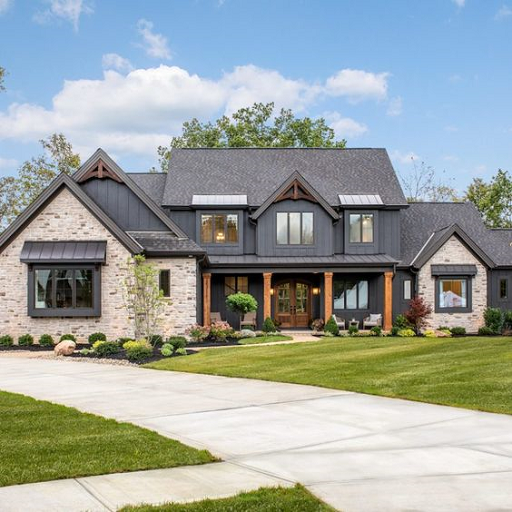

# ControlLoRA Version 3: A Lightweight Neural Network To Control Stable Diffusion Spatial Information Version 3

ControlLoRA Version 3 is a neural network structure extended from [ControlNet](https://github.com/lllyasviel/ControlNet) to control diffusion models by adding extra conditions.

Inspired by [control-lora](https://huggingface.co/stabilityai/control-lora) (StabilityAI), [ControlLoRA](https://github.com/HighCWu/ControlLoRA), [control-lora-v2](https://github.com/HighCWu/control-lora-v2) and script [train_controlnet.py](https://github.com/huggingface/diffusers/blob/main/examples/controlnet/train_controlnet.py) from [diffusers](https://github.com/huggingface/diffusers), [control-lora-v3](https://github.com/lavinal712/control-lora-v3) does not add new features, but provides a [PEFT](https://github.com/huggingface/peft) implement of ControlLoRA.

## News

- [x] Jul. 18, 2024. Add convert script for [WebUI](https://huggingface.co/stabilityai/stable-diffusion-xl-base-1.0). (Jul. 31, 2024. Bug fixed.)
- [x] Jun. 08, 2024. Norm layer is trainable. 
- [x] May. 19, 2024. Add [DoRA](https://arxiv.org/abs/2402.09353).

## Data

To train ControlLoRA, you should have image-conditioning_image-text datasets. Of course you can hardly train on [LAION-5B](https://openxlab.org.cn/datasets/OpenDataLab/LAION-5B) dataset in direct like Stable Diffusion. Here are some:

- [fusing/fill50k](https://huggingface.co/datasets/fusing/fill50k). I do not suggest you to train ControlLoRA seriously as it is simple and lack of diversity.
- [HighCWu/diffusiondb_2m_first_5k_canny](https://huggingface.co/datasets/HighCWu/diffusiondb_2m_first_5k_canny). A small canny dataset. Here is [poloclub/diffusiondb](https://huggingface.co/datasets/poloclub/diffusiondb) dataset. For canny condition, you can easily generate your own dataset.
- [Nahrawy/VIDIT-Depth-ControlNet](https://huggingface.co/datasets/Nahrawy/VIDIT-Depth-ControlNet). Depth map? Heat map? But it is good!
- [SaffalPoosh/scribble_controlnet_dataset](https://huggingface.co/datasets/SaffalPoosh/scribble_controlnet_dataset). Many duplicate images. I suggest you synthesize your dataset.
- [lavinal712/SAM-LLAVA-55k-canny](https://huggingface.co/datasets/lavinal712/SAM-LLAVA-55k-canny). A canny dataset with detail caption.

## Models

### Stable Diffusion

[Stable Diffusion v1-5](https://huggingface.co/runwayml/stable-diffusion-v1-5) is the base model.

[Stable Diffusion v1-4](https://huggingface.co/CompVis/stable-diffusion-v1-4), [Stable Diffusion v2-1](https://huggingface.co/stabilityai/stable-diffusion-2-1), [Stable Diffusion XL](https://huggingface.co/stabilityai/stable-diffusion-xl-base-1.0) need to be vertified.

### ControlLoRA

- [lavinal712/sd-control-lora-canny-v3](https://huggingface.co/lavinal712/sd-control-lora-canny-v3). Canny condition model trained on [lavinal712/SAM-LLAVA-55k-canny](https://huggingface.co/datasets/lavinal712/SAM-LLAVA-55k-canny) with 50000 steps, including converted ControlLoRA model, merged ControlNet model and original adapter model.

## Train

You can train either ControlNet or ControlLoRA using script [train_control_lora.py](https://github.com/lavinal712/control-lora-v3/blob/main/train_control_lora.py).

### Train ControlNet

By observation, training 50000 steps with batch size of 4 is the balance between image quality, control ability and time.

```bash
accelerate launch train_control_lora.py \
 --pretrained_model_name_or_path="runwayml/stable-diffusion-v1-5" \
 --output_dir="controlnet-model" \
 --dataset_name="fusing/fill50k" \
 --resolution=512 \
 --learning_rate=1e-5 \
 --train_batch_size=4 \
 --max_train_steps=100000 \
 --tracker_project_name="controlnet" \
 --checkpointing_steps=5000 \
 --validation_steps=5000 \
 --report_to wandb
```

### Train ControlLoRA

To train ControlLoRA, add `--use_lora` in start command to activate it.

```bash
accelerate launch train_control_lora.py \
 --pretrained_model_name_or_path="runwayml/stable-diffusion-v1-5" \
 --output_dir="control-lora-model" \
 --dataset_name="fusing/fill50k" \
 --resolution=512 \
 --learning_rate=1e-4 \
 --train_batch_size=4 \
 --max_train_steps=100000 \
 --tracker_project_name="control-lora" \
 --checkpointing_steps=5000 \
 --validation_steps=5000 \
 --report_to wandb \
 --use_lora \
 --lora_r=32 \
 --lora_bias="all"
```

You can also train ControlLoRA / ControlNet with your own dataset.

```bash
accelerate launch train_control_lora.py \
 --pretrained_model_name_or_path="runwayml/stable-diffusion-v1-5" \
 --output_dir="control-lora-model" \
 --conditioning_image_column="hint" \
 --image_column="jpg" \
 --caption_column="txt" \
 --resolution=512 \
 --learning_rate=1e-4 \
 --train_batch_size=4 \
 --num_train_epochs=3 \
 --max_train_steps=100000 \
 --tracker_project_name="control-lora" \
 --checkpointing_steps=5000 \
 --validation_steps=5000 \
 --report_to wandb \
 --use_lora \
 --lora_r=32 \
 --lora_bias="all" \
 --custom_dataset="custom_datasets.tutorial.MyDataset"
```

## Merge

If you want to merge ControlLoRA to ControlNet, use [merge_lora.py](https://github.com/lavinal712/control-lora-v3/blob/main/merge_lora.py) script.

```bash
python merge_lora.py --base_model runwayml/stable-diffusion-v1-5 --control_lora /path/to/control-lora --output_dir /path/to/save/ControlNet
```

## Convert

Now you can convert ControlLoRA weight from HuggingFace diffusers type to Stable Diffusion type. The converted model can be used in AUTOMATIC1111's [Stable Diffusion web UI](https://github.com/AUTOMATIC1111/stable-diffusion-webui) and [ComfyUI](https://github.com/comfyanonymous/ComfyUI).

PS: ControlLoRA should set `--lora_bias="all"` in training script.

```bash
python convert_diffusers.py --adapter_model /path/to/adapter/model --output_model /path/to/output/model
```

## Test

Original image:



Output:


## Citation

    @software{lavinal7122024controllorav3,
        author = {lavinal712},
        month = {5},
        title = {{ControlLoRA Version 3: A Lightweight Neural Network To Control Stable Diffusion Spatial Information Version 3}},
        url = {https://github.com/lavinal712/control-lora-v3},
        version = {1.0.0},
        year = {2024}
    }
